# Comprehensive Prioritized Keyword Framework for Brain-Sidecar Energy Consulting Conversations

## Executive summary

This report builds a conversation-identification keyword framework for an energy-consulting Brain-Sidecar deployment by triangulating terminology from primary and quasi-primary industry sources: entity["organization","International Energy Agency","intergovernmental energy organization"] materials on energy efficiency, electrification, demand response, demand flexibility, renewables, and industry; entity["organization","United States Department of Energy","U.S. federal department"] and its Better Buildings, FEMP, and industrial programs on audits, commissioning, EMIS, ESPCs, industrial systems, electrification, DERs, and resilience; entity["organization","United States Environmental Protection Agency","U.S. federal environmental regulator"] resources on benchmarking, EUI, CHP, eGRID, and emissions factors; entity["organization","International Organization for Standardization","standards organization"] standards in the 50000 family; entity["organization","Federal Energy Regulatory Commission","U.S. energy regulator"] and entity["organization","U.S. Energy Information Administration","U.S. federal energy statistics agency"] glossaries for tariff, demand, and grid-market language; entity["organization","National Renewable Energy Laboratory","U.S. national laboratory"] procurement guidance for PPAs, RECs, EACs, and green tariffs; the entity["organization","Greenhouse Gas Protocol","GHG accounting framework"] for Scope 1/2/3 and market-based vs location-based accounting; entity["organization","ASHRAE","building systems and HVAC standards organization"] audit terminology; and climate-disclosure and target-setting language from the entity["organization","International Sustainability Standards Board","sustainability disclosure standard setter"] and the entity["organization","Science Based Targets initiative","corporate climate target partnership"]. I also incorporated high-frequency consulting language such as business case, roadmap, proposal, and savings opportunity because Brain-Sidecar needs to identify both technical conversations and client-facing commercial discussions. citeturn16search12turn18search2turn18search10turn15search5turn15search0turn15search2turn3search0turn3search3turn10search1turn10search6turn12search1turn13search10turn9search3turn17search0turn17search6turn8search0turn8search13

Assumption: no geographic constraint. I therefore prioritized globally portable English phrases, then added widely used acronyms and a limited set of jurisdiction-heavy terms only when they are common in multinational energy-management or carbon-reporting conversations. The weight is **not** search volume; it is a heuristic probability that a phrase indicates an energy-consulting conversation. The highest weights favor terms that are both semantically specific to energy consulting and commercially important in advisory, procurement, optimization, decarbonization, and compliance workflows. Lower weights are used for acronyms with ambiguity, narrower specialist terms, or phrases more likely to appear in adjacent domains. citeturn23search0turn23search3turn24search1turn24search0turn6search0turn22search18

## Weighting and category model

The weighting model uses four signals. First, **domain specificity**: phrases like “energy audit,” “decarbonization roadmap,” and “demand response” strongly indicate the target domain. Second, **workflow centrality**: terms used across advisory, implementation, procurement, carbon accounting, or optimization rank higher than one-off technical subtopics. Third, **commercial signal strength**: phrases likely to occur in lead-gen, sales, or scoping conversations receive a lift because they help Brain-Sidecar identify qualified opportunities, not just technical chatter. Fourth, **cross-source persistence**: vocabulary that appears across standards, public-agency guidance, and market materials is weighted above niche or vendorish terminology. This structure mirrors how the cited sources organize the sector: energy management and audits; benchmarking and KPIs; commissioning and analytics; demand flexibility and tariffs; procurement and environmental attributes; decarbonization and climate disclosure; and financing and performance contracts. citeturn15search5turn15search0turn3search3turn23search0turn18search14turn12search1turn4search4turn17search0

A practical interpretation of the weights is: **0.95–1.00** for identity-defining terms, **0.85–0.94** for very strong workflow terms, **0.70–0.84** for common but narrower or acronym-heavy terms, and **0.55–0.69** for important but more context-dependent phrases. Categories are intentionally broad enough for routing and analytics inside Brain-Sidecar: **commercial, service, operations, technical, technology, market, sustainability, finance, and regulatory**.

## Category relationships

The category structure below reflects how the source families cluster the energy-consulting domain: standards and audits feed operational benchmarking and commissioning; market and tariff language connects to procurement and flexibility; technology terms center on DERs, storage, electrification, and building/plant systems; sustainability terms connect carbon accounting, reporting, and transition planning. citeturn15search5turn3search3turn18search14turn12search1turn4search1turn17search4

```mermaid
flowchart TD
    A[Energy Consulting] --> B[Service]
    A --> C[Operations]
    A --> D[Market]
    A --> E[Technology]
    A --> F[Sustainability]
    A --> G[Finance]
    A --> H[Regulatory]

    B --> B1[Advisory]
    B --> B2[Audits]
    B --> B3[Scoping]

    C --> C1[Benchmarking]
    C --> C2[KPIs]
    C --> C3[Commissioning]
    C --> C4[EMIS and Analytics]

    D --> D1[Tariffs]
    D --> D2[Demand Flexibility]
    D --> D3[Procurement]

    E --> E1[DER and Storage]
    E --> E2[CHP and Thermal]
    E --> E3[Electrification]
    E --> E4[Controls and Metering]

    F --> F1[Carbon Accounting]
    F --> F2[Disclosure]
    F --> F3[Target Setting]

    G --> G1[Incentives]
    G --> G2[Capital Budgeting]
    G --> G3[Performance Contracting]

    H --> H1[ISO and ASHRAE]
    H --> H2[Building Policy]
    H --> H3[Climate Frameworks]
```

## Highest-weight phrases

The highest-weight cluster is dominated by core advisory and trigger phrases that strongly signal the domain in both technical and commercial conversations: energy consulting, energy efficiency, energy management, energy audit, decarbonization, energy procurement, utility bill analysis, tariff optimization, demand response, and decarbonization roadmap. That pattern is consistent with how agencies and standards bodies frame the field: energy performance improvement, demand-side flexibility, procurement and attributes, benchmarking, carbon accounting, and continual improvement. citeturn16search12turn18search2turn23search0turn3search0turn12search1turn4search4turn15search5

| Phrase | Primary signal | Weight |
|---|---|---:|
| energy consulting | strongest direct lead-gen identifier | 0.99 |
| energy efficiency | universal core concept | 0.98 |
| energy management | cross-workflow anchor term | 0.98 |
| energy audit | high-intent advisory trigger | 0.98 |
| decarbonization | strong transition and strategy signal | 0.97 |
| energy savings | common commercial and technical trigger | 0.96 |
| utility bill analysis | strong diagnostic and lead-gen phrase | 0.95 |
| energy procurement | strong buyer-intent phrase | 0.95 |
| decarbonization roadmap | strong strategy and consulting signal | 0.95 |
| demand response | strong market and flexibility signal | 0.94 |
| energy strategy | strong executive/advisory signal | 0.94 |
| energy cost reduction | common pain-point phrase | 0.93 |
| energy benchmarking | common portfolio and compliance trigger | 0.93 |
| retro-commissioning | strong building-optimization term | 0.93 |
| demand flexibility | strong grid and load-management signal | 0.92 |
| power purchase agreement | strong procurement signal | 0.92 |
| energy use intensity | strong benchmarking KPI | 0.91 |
| tariff analysis | strong utility-cost optimization signal | 0.91 |
| demand charge management | strong billing and optimization signal | 0.91 |
| ISO 50001 | strong standards/compliance signal | 0.90 |

## Core advisory, audit, operations, and sales keywords

The following table emphasizes the vocabulary most likely to appear in scoping, audits, benchmarking, EMIS, commissioning, and early-stage commercial conversations. These phrases are grounded primarily in ISO 50001/50002 energy-management and audit frameworks, EPA Portfolio Manager benchmarking terminology, DOE/FEMP EMIS and commissioning guidance, and ASHRAE audit language. citeturn15search5turn15search0turn5search1turn3search0turn3search3turn3search5turn23search0turn23search3turn11search4turn11search12turn9search3

| Exact phrase | Normalized token | Category | Subcategory | Intent tags | Synonyms / variants | Weight |
|---|---|---|---|---|---|---:|
| energy consulting | energy consulting | commercial | advisory | informational; transactional; lead-gen | energy advisory; energy consultancy; engery consulting | 0.99 |
| energy consultant | energy consultant | commercial | advisory | informational; transactional; lead-gen | energy advisor; energy consulting firm | 0.95 |
| energy strategy | energy strategy | service | strategy | informational; transactional; lead-gen | energy roadmap; strategic energy plan | 0.94 |
| energy efficiency | energy efficiency | technical | core concept | informational; transactional; lead-gen | efficiency; energy effeciency; efficient energy use | 0.98 |
| energy savings | energy savings | commercial | value proposition | informational; transactional; lead-gen | save energy; savings potential | 0.96 |
| energy cost reduction | energy cost reduction | commercial | value proposition | informational; transactional; lead-gen | utility cost reduction; lower energy costs | 0.93 |
| energy management | energy management | operations | program management | informational; transactional; support; lead-gen | energy mgmt; energy-management | 0.98 |
| strategic energy management | strategic energy management | operations | program management | informational; transactional; lead-gen | SEM program; strategic energy plan | 0.91 |
| energy audit | energy audit | service | audit | informational; transactional; lead-gen | energy assessment; site audit; engery audit | 0.98 |
| ASHRAE Level 1 audit | ashrae level 1 audit | regulatory | audit standard | informational; transactional; lead-gen | level 1 audit; walkthrough energy audit | 0.84 |
| ASHRAE Level 2 audit | ashrae level 2 audit | regulatory | audit standard | informational; transactional; lead-gen | level 2 audit; energy survey and analysis | 0.88 |
| ASHRAE Level 3 audit | ashrae level 3 audit | regulatory | audit standard | informational; transactional; lead-gen | level 3 audit; detailed analysis | 0.82 |
| investment grade audit | investment grade audit | service | audit | informational; transactional; lead-gen | IGA; investment-grade audit; bankable audit | 0.85 |
| feasibility study | feasibility study | service | assessment | informational; transactional; lead-gen | feasibility assessment; technoeconomic study | 0.86 |
| site assessment | site assessment | service | assessment | informational; transactional; lead-gen | facility assessment; onsite assessment | 0.86 |
| portfolio assessment | portfolio assessment | service | portfolio planning | informational; transactional; lead-gen | portfolio review; multi-site assessment | 0.83 |
| utility bill analysis | utility bill analysis | operations | billing analytics | informational; support; lead-gen | bill review; utility analysis | 0.95 |
| utility bill management | utility bill management | operations | billing analytics | informational; support; transactional | bill management; invoice management | 0.83 |
| energy benchmarking | energy benchmarking | operations | benchmarking | informational; transactional; lead-gen | building benchmarking; portfolio benchmarking | 0.93 |
| ENERGY STAR Portfolio Manager | energy star portfolio manager | software | benchmarking tool | informational; support; compliance | portfolio manager; ENERGY STAR PM | 0.82 |
| energy use intensity | energy use intensity | operations | KPI | informational; support; compliance | EUI; energy intensity; energy usage intensity | 0.91 |
| EUI | eui | operations | KPI acronym | informational; support; compliance | energy use intensity; energy usage intensity | 0.80 |
| energy baseline | energy baseline | operations | KPI | informational; support; compliance | baseline; EnB; baseline period | 0.89 |
| energy performance indicator | energy performance indicator | operations | KPI | informational; support; compliance | EnPI; performance metric; energy KPI | 0.87 |
| significant energy use | significant energy use | operations | EnMS | informational; support; compliance | SEU; major energy use | 0.84 |
| energy review | energy review | operations | EnMS | informational; support; compliance | management review; energy review process | 0.82 |
| energy management information system | energy management information system | technology | analytics platform | informational; support; transactional | EMIS; energy analytics platform | 0.90 |
| building automation system | building automation system | technology | controls | informational; support; transactional | BAS; building controls system | 0.90 |
| commissioning | commissioning | operations | commissioning | informational; transactional; lead-gen | Cx; building commissioning | 0.91 |
| retro-commissioning | retro commissioning | operations | commissioning | informational; transactional; lead-gen | RCx; retrocommissioning; retro commisioning | 0.93 |
| RCx | rcx | operations | commissioning acronym | informational; transactional; lead-gen | retro-commissioning; retrocommissioning | 0.77 |
| monitoring-based commissioning | monitoring based commissioning | operations | commissioning | informational; support; transactional | MBCx; analytics-based commissioning | 0.84 |
| continuous commissioning | continuous commissioning | operations | commissioning | informational; support; transactional | ongoing commissioning; continuous commisioning | 0.80 |
| fault detection and diagnostics | fault detection and diagnostics | technology | analytics | informational; support; transactional | FDD; fault detection & diagnostics | 0.89 |
| sequence of operations | sequence of operations | operations | controls | informational; support; transactional | SOO; sequence of operation; control sequence | 0.79 |
| submetering | submetering | operations | metering | informational; support; transactional | sub-metering; submeters | 0.85 |
| load profile | load profile | operations | metering | informational; support; transactional | load shape; usage profile; demand profile | 0.89 |
| request for proposal | request for proposal | commercial | sales | informational; transactional; lead-gen | RFP; tender request | 0.84 |
| proposal | proposal | commercial | sales | informational; transactional; lead-gen | commercial proposal; quote | 0.82 |
| implementation roadmap | implementation roadmap | service | strategy | informational; transactional; lead-gen | execution roadmap; implementation plan | 0.87 |
| scope of work | scope of work | commercial | sales | informational; transactional; lead-gen | SOW; work scope; project scope | 0.86 |

## Market, technology, systems, and flexibility keywords

This table prioritizes the vocabulary of utility-cost optimization, tariffs, demand flexibility, clean-power procurement, DERs, storage, resilience, thermal systems, and electrification. It is grounded in IEA demand-response and electrification materials, FERC and EIA market definitions, NREL procurement guidance, DOE resilience and microgrid resources, and EPA CHP materials. citeturn18search2turn18search10turn16search1turn16search12turn6search0turn22search18turn18search1turn7search0turn7search8turn12search1turn13search10turn22search1turn10search6turn10search2

| Exact phrase | Normalized token | Category | Subcategory | Intent tags | Synonyms / variants | Weight |
|---|---|---|---|---|---|---:|
| measurement and verification | measurement and verification | technical | performance verification | informational; support; transactional | M&V; savings verification | 0.91 |
| M&V | mv | technical | performance verification acronym | informational; support; transactional | measurement and verification | 0.79 |
| IPMVP | ipmvp | regulatory | performance protocol | informational; support; compliance | International Performance Measurement and Verification Protocol | 0.80 |
| energy conservation measure | energy conservation measure | technical | project measure | informational; support; transactional | ECM; efficiency measure | 0.88 |
| demand response | demand response | market | flexibility | informational; transactional; lead-gen | DR; demand-side response; demand side response | 0.94 |
| demand flexibility | demand flexibility | market | flexibility | informational; transactional; lead-gen | load flexibility; flexible demand | 0.92 |
| load shifting | load shifting | market | flexibility action | informational; support; transactional | shift load; load shift | 0.89 |
| peak shaving | peak shaving | market | flexibility action | informational; transactional; lead-gen | peak reduction; peak clipping | 0.90 |
| peak demand | peak demand | market | billing and grid | informational; support; transactional | max demand; peak load; billing demand | 0.88 |
| demand charge management | demand charge management | market | billing and grid | informational; transactional; lead-gen | demand charge reduction; demand cost control | 0.91 |
| time-of-use rate | time of use rate | market | tariff | informational; support; transactional | TOU rate; time-of-day pricing | 0.88 |
| real-time pricing | real time pricing | market | tariff | informational; support; transactional | RTP; dynamic pricing; spot pricing | 0.79 |
| tariff analysis | tariff analysis | market | tariff | informational; transactional; lead-gen | rate analysis; tariff review | 0.91 |
| rate optimization | rate optimization | market | tariff | informational; transactional; lead-gen | tariff optimization; bill optimization | 0.89 |
| energy procurement | energy procurement | market | sourcing | informational; transactional; lead-gen | energy sourcing; power procurement | 0.95 |
| renewable energy procurement | renewable energy procurement | market | sourcing | informational; transactional; lead-gen | renewable sourcing; clean electricity procurement | 0.91 |
| power purchase agreement | power purchase agreement | market | contracting | informational; transactional; lead-gen | PPA; power offtake agreement | 0.92 |
| physical PPA | physical ppa | market | contracting | informational; transactional; lead-gen | sleeved PPA; bundled PPA | 0.77 |
| virtual PPA | virtual ppa | market | contracting | informational; transactional; lead-gen | VPPA; financial PPA; synthetic PPA | 0.82 |
| green tariff | green tariff | market | utility sourcing | informational; transactional; lead-gen | green rate; utility green tariff | 0.83 |
| renewable energy certificate | renewable energy certificate | market | environmental attribute | informational; transactional; compliance | REC; renewable certificate | 0.87 |
| energy attribute certificate | energy attribute certificate | market | environmental attribute | informational; transactional; compliance | EAC; certificate of origin | 0.79 |
| behind-the-meter | behind the meter | market | DER placement | informational; transactional; support | behind the meter; BTM; customer-sited | 0.82 |
| distributed energy resource | distributed energy resource | technology | DER | informational; transactional; lead-gen | DER; distributed resources | 0.89 |
| DER aggregation | der aggregation | market | DER participation | informational; transactional; lead-gen | aggregated DER; DER aggregator | 0.80 |
| DERMS | derms | technology | grid software | informational; transactional; lead-gen | distributed energy resource management system | 0.74 |
| virtual power plant | virtual power plant | technology | aggregation | informational; transactional; lead-gen | VPP; flexibility aggregation | 0.87 |
| battery energy storage system | battery energy storage system | technology | storage | informational; transactional; lead-gen | BESS; battery storage | 0.88 |
| microgrid | microgrid | technology | resilience | informational; transactional; lead-gen | micro-grid; campus microgrid | 0.88 |
| resilience assessment | resilience assessment | service | resilience | informational; transactional; lead-gen | resiliency assessment; resilience study | 0.84 |
| solar PV | solar pv | technology | onsite generation | informational; transactional; lead-gen | solar photovoltaic; PV system | 0.86 |
| combined heat and power | combined heat and power | technology | thermal generation | informational; transactional; lead-gen | CHP; cogeneration; cogen | 0.88 |
| CHP | chp | technology | thermal generation acronym | informational; transactional; lead-gen | combined heat and power; cogeneration | 0.76 |
| waste heat recovery | waste heat recovery | technical | thermal efficiency | informational; transactional; lead-gen | heat recovery; WHR | 0.88 |
| heat pump | heat pump | technology | electrification | informational; transactional; lead-gen | air-source heat pump; heat-pump | 0.85 |
| electrification | electrification | technical | transition lever | informational; transactional; lead-gen | electrifying loads; electrfication | 0.91 |
| building electrification | building electrification | technical | transition lever | informational; transactional; lead-gen | all-electric building; HVAC electrification | 0.86 |
| industrial electrification | industrial electrification | technical | transition lever | informational; transactional; lead-gen | process electrification; heat electrification | 0.87 |
| process heating | process heating | technical | industrial systems | informational; transactional; support | industrial heat; process heat | 0.81 |
| smart meter | smart meter | technology | metering | informational; transactional; support | advanced meter; interval meter | 0.78 |

## Sustainability, finance, standards, contracting, and pain-point keywords

This table captures the vocabulary that signals carbon accounting, disclosure, transition planning, incentive and project finance, performance contracting, and common client pain points. The dominant source base is GHG Protocol, EPA eGRID and emissions-factor guidance, IFRS S2 and SBTi materials, ISO 50001-family standards, DOE 50001 Ready and SEP materials, and DOE/Better Buildings financing and ESPC resources. citeturn4search1turn4search4turn10search0turn10search1turn10search5turn17search0turn17search4turn17search6turn15search5turn24search1turn24search0turn2search2turn14search15turn14search7turn14search3

| Exact phrase | Normalized token | Category | Subcategory | Intent tags | Synonyms / variants | Weight |
|---|---|---|---|---|---|---:|
| greenhouse gas inventory | greenhouse gas inventory | sustainability | carbon accounting | informational; compliance; lead-gen | GHG inventory; emissions inventory; carbon inventory | 0.90 |
| GHG inventory | ghg inventory | sustainability | carbon accounting acronym | informational; compliance; lead-gen | greenhouse gas inventory; emissions inventory | 0.77 |
| scope 1 emissions | scope 1 emissions | sustainability | carbon accounting | informational; compliance | direct emissions; scope one | 0.86 |
| scope 2 emissions | scope 2 emissions | sustainability | carbon accounting | informational; compliance | purchased electricity emissions; scope two | 0.89 |
| scope 3 emissions | scope 3 emissions | sustainability | carbon accounting | informational; compliance | value chain emissions; scope three | 0.84 |
| location-based emissions | location based emissions | sustainability | scope 2 method | informational; compliance | location based method; grid-average method | 0.77 |
| market-based emissions | market based emissions | sustainability | scope 2 method | informational; compliance | market-based method; contract-based electricity emissions | 0.77 |
| emissions factor | emissions factor | sustainability | carbon accounting | informational; support; compliance | emission factor; carbon factor; grid factor | 0.83 |
| carbon accounting | carbon accounting | sustainability | carbon accounting | informational; compliance; lead-gen | emissions accounting; climate accounting | 0.89 |
| decarbonization | decarbonization | sustainability | transition strategy | informational; transactional; lead-gen | decarbonisation; carbon reduction; emissions reduction | 0.97 |
| decarbonization roadmap | decarbonization roadmap | sustainability | transition strategy | informational; transactional; lead-gen | decarbonisation roadmap; decarb roadmap; net-zero roadmap | 0.95 |
| net zero | net zero | sustainability | target setting | informational; compliance; lead-gen | net-zero; net zero target | 0.90 |
| climate transition plan | climate transition plan | sustainability | transition strategy | informational; compliance; lead-gen | transition plan; climate plan | 0.81 |
| science-based target | science based target | sustainability | target setting | informational; compliance; lead-gen | SBT; science based target | 0.80 |
| marginal abatement cost curve | marginal abatement cost curve | sustainability | analytics | informational; compliance; lead-gen | MACC; abatement cost curve | 0.77 |
| ESG reporting | esg reporting | sustainability | reporting | informational; compliance; lead-gen | ESG disclosure; sustainability reporting | 0.82 |
| sustainability reporting | sustainability reporting | sustainability | reporting | informational; compliance; lead-gen | nonfinancial reporting; climate reporting | 0.84 |
| climate disclosure | climate disclosure | sustainability | reporting | informational; compliance; lead-gen | carbon disclosure; climate-related disclosure | 0.83 |
| building performance standard | building performance standard | regulatory | building policy | informational; compliance; lead-gen | BPS; building emissions performance standard | 0.78 |
| ISO 50001 | iso 50001 | regulatory | energy management standard | informational; compliance; lead-gen | energy management system standard; iso50001 | 0.90 |
| ISO 50002 | iso 50002 | regulatory | energy audit standard | informational; compliance; lead-gen | energy audit standard; iso50002 | 0.76 |
| ISO 50015 | iso 50015 | regulatory | M&V standard | informational; compliance | measurement and verification standard | 0.64 |
| 50001 Ready | 50001 ready | regulatory | implementation framework | informational; compliance; lead-gen | ISO 50001 Ready; 50001ready | 0.71 |
| Superior Energy Performance | superior energy performance | regulatory | certification program | informational; compliance; lead-gen | SEP; superior energy performance certification | 0.68 |
| business case | business case | finance | project justification | informational; transactional; lead-gen | investment case; project justification | 0.88 |
| simple payback | simple payback | finance | capital budgeting | informational; support; transactional | payback period; pay back | 0.83 |
| return on investment | return on investment | finance | capital budgeting | informational; support; transactional | ROI; investment return | 0.86 |
| net present value | net present value | finance | capital budgeting | informational; support; transactional | NPV; discounted cash flow value | 0.80 |
| internal rate of return | internal rate of return | finance | capital budgeting | informational; support; transactional | IRR; hurdle-rate proxy | 0.77 |
| capital expenditure | capital expenditure | finance | budgeting | informational; support; transactional | CAPEX; capital cost; upfront capital | 0.81 |
| operating expenditure | operating expenditure | finance | budgeting | informational; support; transactional | OPEX; operating cost; run cost | 0.80 |
| total cost of ownership | total cost of ownership | finance | budgeting | informational; support; transactional | TCO; whole-life cost | 0.82 |
| utility incentive | utility incentive | finance | incentives | informational; transactional; lead-gen | efficiency incentive; program incentive | 0.87 |
| utility rebate | utility rebate | finance | incentives | informational; transactional; lead-gen | energy rebate; rebate program | 0.89 |
| energy savings performance contract | energy savings performance contract | finance | performance contracting | informational; transactional; lead-gen | ESPC; performance contract | 0.84 |
| energy service company | energy service company | commercial | delivery model | informational; transactional; lead-gen | ESCO; energy services firm | 0.82 |
| energy service agreement | energy service agreement | finance | service contracting | informational; transactional; lead-gen | ESA; as-a-service energy contract | 0.79 |
| shared savings | shared savings | finance | service contracting | informational; transactional; lead-gen | gain share; savings share | 0.79 |
| performance guarantee | performance guarantee | finance | service contracting | informational; transactional; lead-gen | guaranteed savings; savings guarantee | 0.78 |
| high energy bill | high energy bill | service | client pain point | complaint; support; lead-gen | high utility bill; expensive energy bill; high electric bill | 0.88 |

## Open questions and limitations

This list is designed for broad English-language conversation identification, not search-engine optimization and not sector-specific engineering design. The weights are source-informed heuristics rather than corpus-trained probabilities because no historical Brain-Sidecar conversation set, CRM taxonomy, or closed-won/lost labels were provided. Acronyms such as RCx, CHP, EMIS, and PPA are useful but can still be ambiguous outside energy contexts, so the practical implementation should combine this table with phrase windows, co-occurrence rules, or classifier features. Because no geography was specified, the list favors globally portable language and only lightly samples region-specific policy or incentive labels.