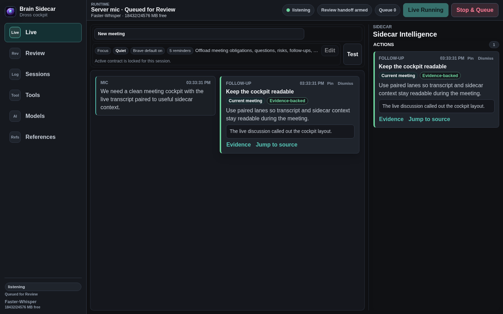
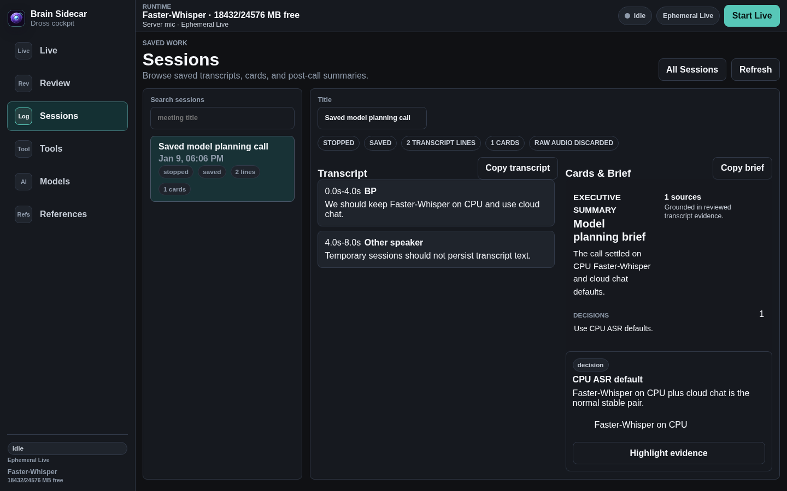
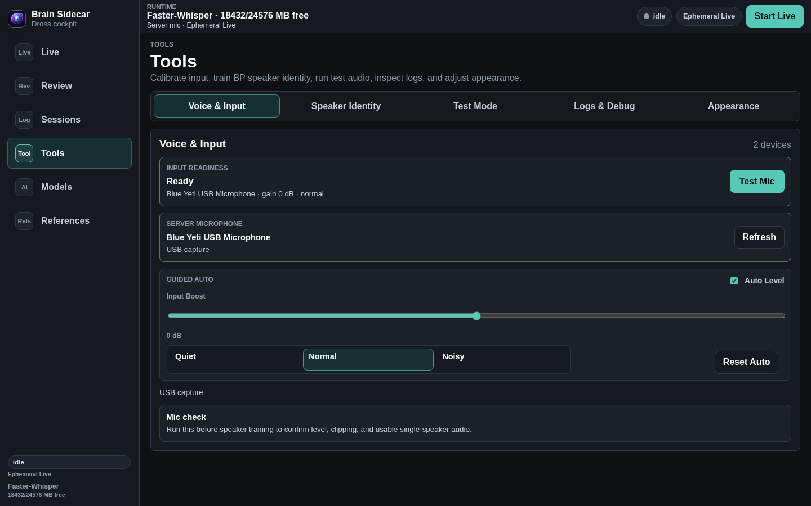
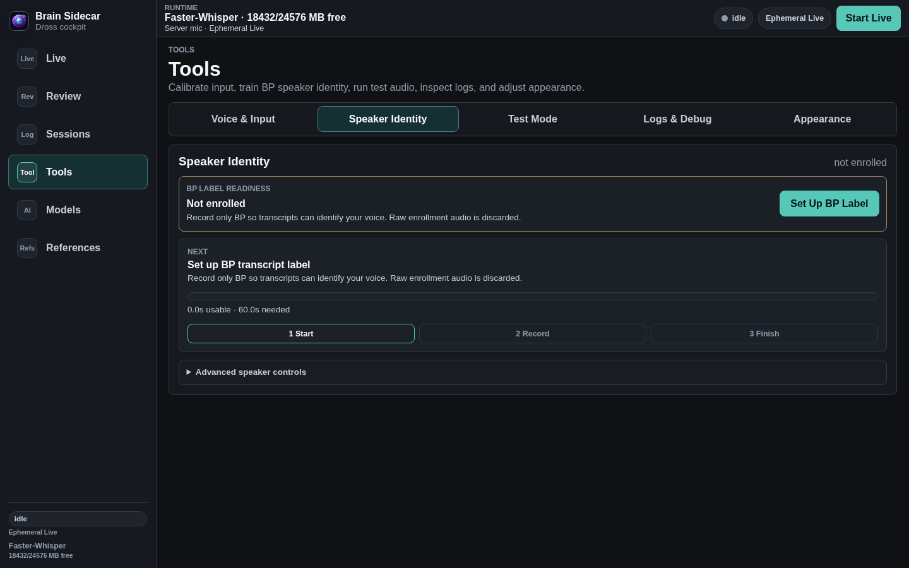
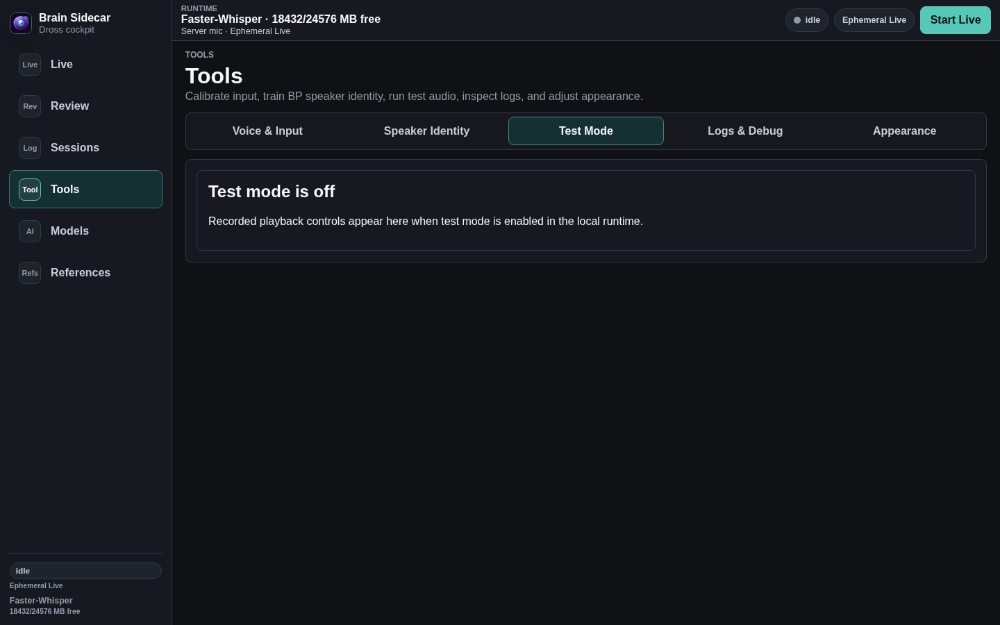
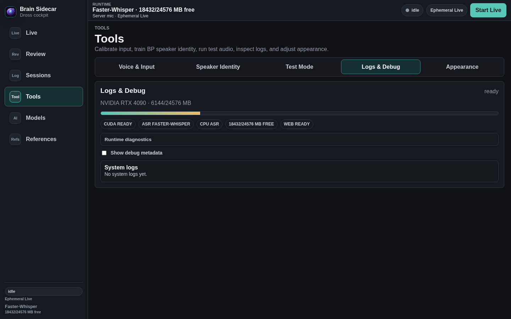
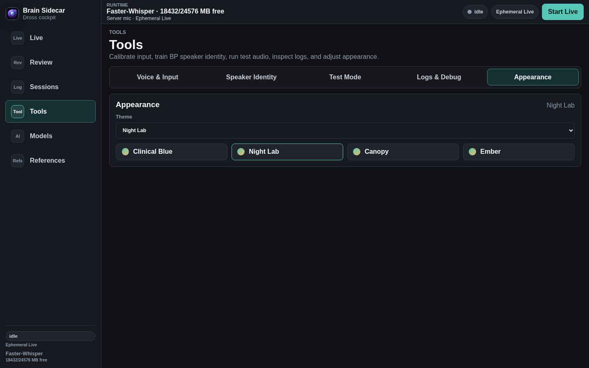
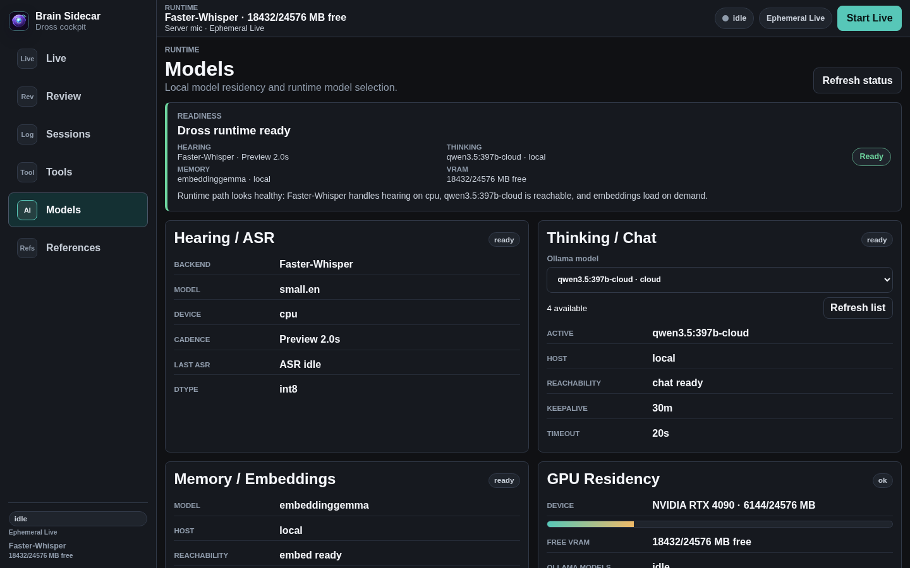
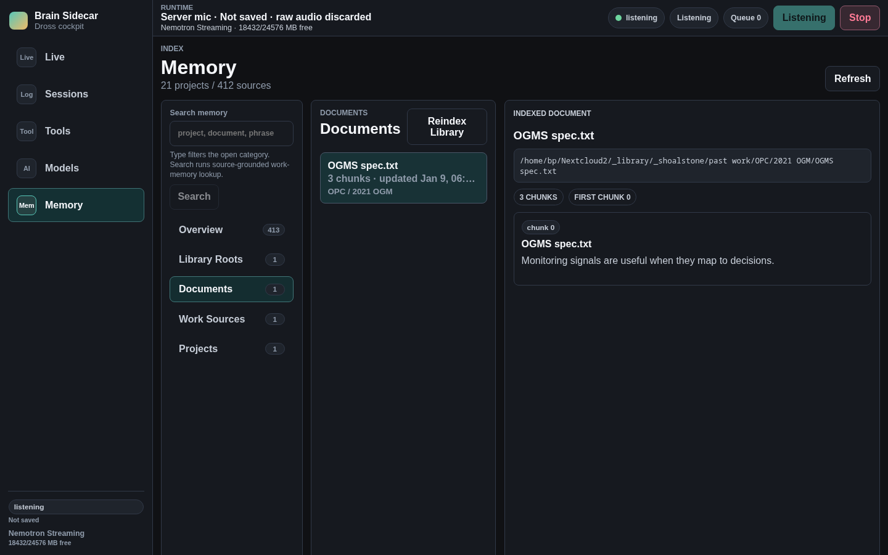

# Meeting Cockpit Screenshots

These PNGs are intentionally committed UI review artifacts for the dark-mode meeting cockpit. They are generated with mocked local data and are not runtime product assets.

| Page | Screenshot |
| --- | --- |
| Live |  |
| Sessions |  |
| Tools |  |
| Tools - Voice & Input |  |
| Tools - Speaker Identity |  |
| Tools - Test Mode |  |
| Tools - Logs & Debug |  |
| Tools - Appearance |  |
| Models |  |
| Memory |  |

Captured at `1440 x 900` with Playwright.

Regenerate explicitly from the repo root:

```bash
BRAIN_SIDECAR_CAPTURE_SCREENSHOTS=1 npm --prefix ui run test:e2e -- ui/e2e/screenshot-pages.spec.ts
```

Normal e2e runs skip screenshot regeneration so these files do not churn accidentally.
